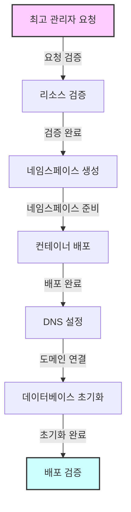
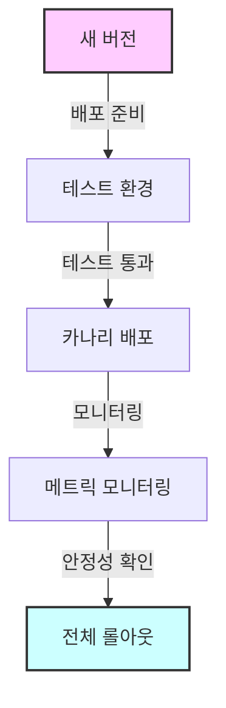

# 이커머스 플랫폼 배포 전략

## 개요

본 문서는 식스샵과 같은 멀티테넌트 이커머스 플랫폼 서비스를 위한 배포 전략과 인프라 구성에 대해 설명합니다. 이 플랫폼은 최고 관리자(SUPER_ADMIN)가 여러 서비스 관리자(SERVICE_ADMIN)를 생성하고 관리할 수 있으며, 각 서비스 관리자는 독립된 환경을 가집니다.

## 아키텍처 설계

### 핵심 구성 요소

1. **컨트롤 플레인**

   - 테넌트 프로비저닝 관리
   - 최고 관리자 작업 처리
   - 컨테이너 배포 오케스트레이션
   - 전역 설정 관리

2. **데이터 플레인**
   - 개별 테넌트 환경
   - 서비스 관리자별 격리된 리소스
   - 컨테이너화된 애플리케이션

### 컨테이너 전략

각 서비스 관리자 환경은 다음으로 구성됩니다:

```yaml
- 프론트엔드 컨테이너:
    - Next.js/React 애플리케이션
    - 테넌트별 테마 및 설정
    - 격리된 빌드와 에셋

- 백엔드 컨테이너:
    - Node.js/Spring Boot API 서버
    - 테넌트별 비즈니스 로직
    - API 게이트웨이 통합

- 데이터베이스:
    - 테넌트별 전용 스키마
    - 데이터 격리
    - 자동화된 백업 및 복구
```

## 인프라 구성

### 쿠버네티스 기반 배포

다음 구성 요소를 포함한 쿠버네티스 컨테이너 오케스트레이션을 사용합니다:

1. **네임스페이스 격리**

   - 서비스 관리자별 전용 네임스페이스
   - 리소스 할당량 및 제한
   - 네트워크 정책을 통한 격리

2. **서비스 메시 (Istio)**

   - 트래픽 관리
   - 보안 정책
   - 관찰 가능성
   - 로드 밸런싱

3. **CI/CD 파이프라인**
   - 자동화된 테넌트 프로비저닝
   - 무중단 배포
   - 롤링 업데이트
   - 자동화된 테스트

## 환경별 구현 방안

### 로컬 개발 환경

```yaml
인프라:
  - Minikube 또는 Kind
  - 로컬 Docker 레지스트리
  - 개발용 데이터베이스
  - 목업 서비스

도구:
  - 로컬 개발용 Skaffold
  - 핫 리로드 활성화
  - 디버그 설정
```

### QA 환경

```yaml
인프라:
  - 관리형 쿠버네티스 클러스터 (소규모)
  - 스테이징 데이터베이스
  - 테스트 데이터셋
  - 모니터링 도구

기능:
  - 통합 테스트
  - 성능 테스트
  - 보안 스캐닝
  - 부하 테스트
```

### 운영 환경

```yaml
인프라:
  - 프로덕션급 쿠버네티스 클러스터
  - 고가용성 구성
  - 지역 분산 데이터베이스
  - CDN 통합

기능:
  - 자동 스케일링
  - 재해 복구
  - 실시간 모니터링
  - 자동화된 백업
```

## 배포 흐름

1. **테넌트 프로비저닝**



2. **업데이트 프로세스**



## 모범 사례

1. **보안**

   - 테넌트별 네트워크 격리
   - 저장 및 전송 중 데이터 암호화
   - 정기적인 보안 감사
   - RBAC 구현

2. **모니터링**

   - Prometheus + Grafana
   - ELK 스택을 통한 로깅
   - 알림 및 통지
   - 성능 메트릭

3. **스케일링**
   - 수평적 파드 자동 스케일링
   - 수직적 파드 자동 스케일링
   - 데이터베이스 커넥션 풀링
   - 캐시 최적화

## 재해 복구

1. **백업 전략**

   - 정기적인 자동 백업
   - 특정 시점 복구
   - 지역 간 복제
   - 백업 테스트

2. **복구 프로세스**
   - 자동 장애 조치
   - 데이터 일관성 검사
   - 서비스 복구
   - 고객 커뮤니케이션

## 비용 최적화

1. **리소스 관리**

   - 컨테이너 크기 최적화
   - 스팟 인스턴스 활용
   - 자동 스케일링 정책
   - 리소스 할당량

2. **모니터링 및 최적화**
   - 테넌트별 비용 할당
   - 리소스 사용량 추적
   - 유휴 리소스 감지
   - 비용 이상 감지

## 결론

이 배포 전략은 다음을 보장합니다:

- 다중 테넌트를 위한 확장성
- 보안 및 격리
- 고가용성
- 비용 효율적인 리소스 활용
- 쉬운 유지보수 및 업데이트

다음 사항을 기반으로 정기적인 검토 및 업데이트가 필요합니다:

- 플랫폼 성장
- 새로운 요구사항
- 기술 발전
- 보안 고려사항

1. 브랜드명 기반 서브도메인:

   - dior.privatesales.co.kr
   - chanel.privatesales.co.kr
   - gucci.privatesales.co.kr

2. 커스텀 서브도메인:

   - shop-dior.privatesales.co.kr
   - store-chanel.privatesales.co.kr
   - boutique-gucci.privatesales.co.kr

3. 지역-브랜드 조합:
   - kr-dior.privatesales.co.kr
   - kr-chanel.privatesales.co.kr

# DNS 레코드 예시

Type: CNAME
Name: \*.privatesales.co.kr
Value: privatesales-lb.co.kr
TTL: 3600

# cert-manager 설정 예시

apiVersion: cert-manager.io/v1
kind: Certificate
metadata:
name: wildcard-privatesales
spec:
dnsNames: - "\*.privatesales.co.kr"
secretName: wildcard-tls

www.privatesales.co.kr?brand=dior
www.privatesales.co.kr?store=chanel
